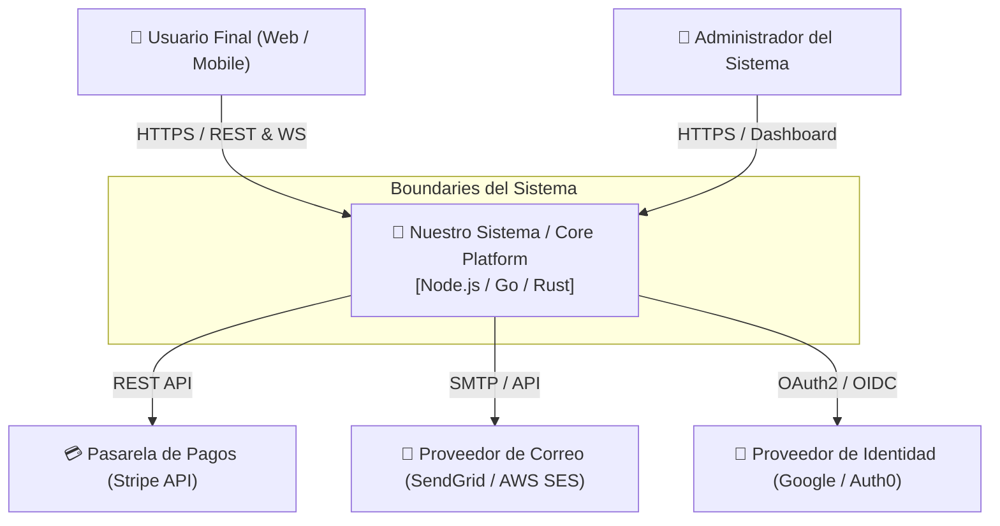
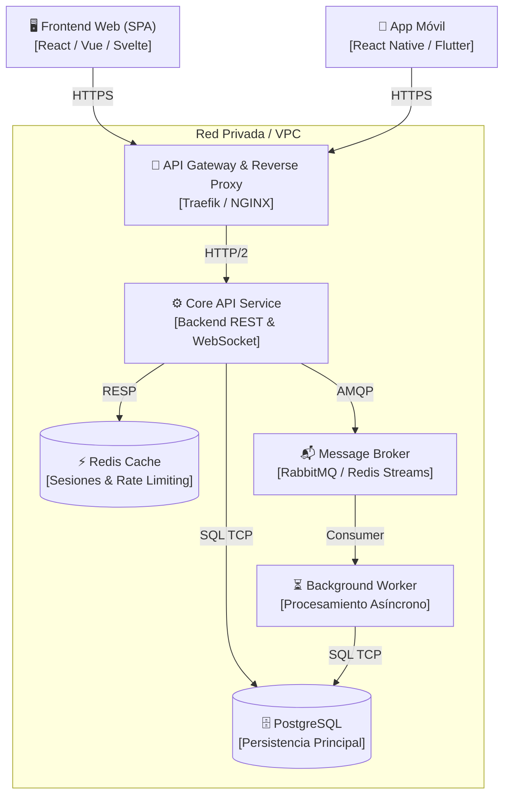
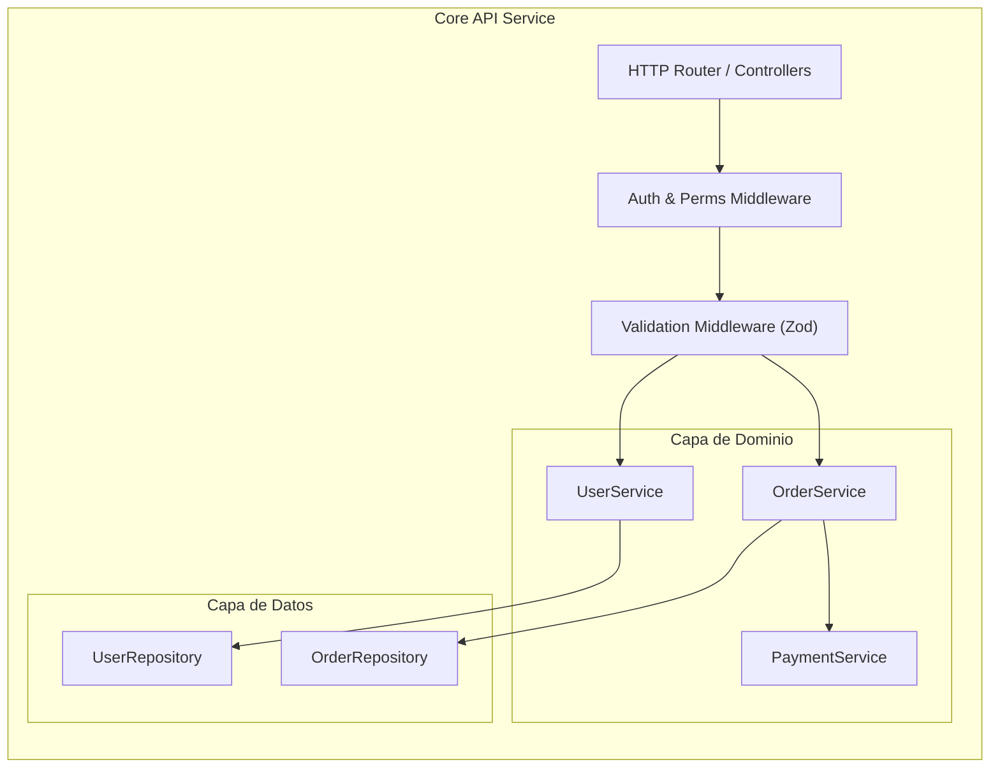

# 🏛️ Arquitectura del Sistema: Modelo C4

Este documento define la arquitectura estructural del sistema en 3 niveles de abstracción complementarios siguiendo el **Modelo C4**.

---

## Nivel 1: Diagrama de Contexto del Sistema

Describe cómo el sistema interactúa con los usuarios y sistemas externos.

---

## Nivel 2: Diagrama de Contenedores

Describe las aplicaciones, microservicios, bases de datos y colas que componen el sistema.

---

## Nivel 3: Diagrama de Componentes

Detalla los módulos internos y responsabilidades dentro del `Core API Service`.

