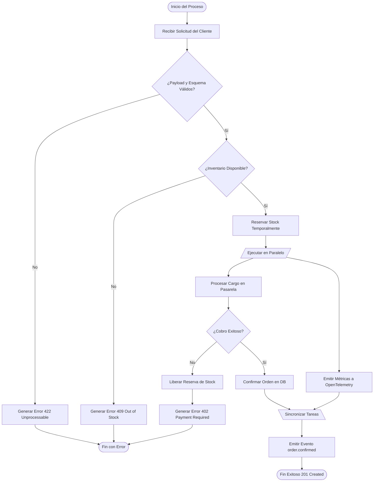

# 🔄 [ACT-XXXX] Diagrama de Actividad: Flujo Lógico y Bifurcaciones

**Identificador:** `ACT-XXXX`  
**Caso de Uso Asociado:** [`UC-XXXX`](../../use-cases/UC-TEMPLATE.md)  
**Propósito:** Modelar el flujo de trabajo de negocio, puntos de decisión y ejecuciones paralelas.

---

## 1. Diagrama de Actividad / Flujo de Decisión

## 2. Puntos Críticos de Decisión
1. **Validación de Schema:** Se detiene inmediatamente antes de cualquier llamada a base de datos.
2. **Reserva de Stock + Rollback:** Si el cobro falla, la reserva temporal se cancela atómicamente.
3. **Paralelismo Seguro:** La telemetría no bloquea la confirmación del pago.
