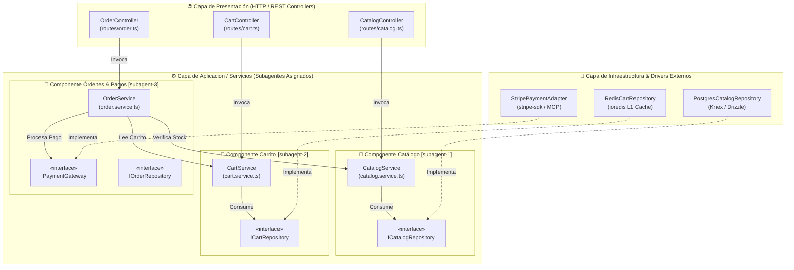

# 🧩 [CMP-XXXX] Diagrama de Componentes e Interfaces

| Campo | Valor / Descripción |
| :--- | :--- |
| **Identificador:** | `CMP-XXXX` (Formato `CMP-XXXX`, inmutable y correlativo) |
| **Subsistema / Dominio:** | [e.g. Núcleo E-Commerce / Gestión de Catálogo y Carrito] |
| **Casos de Uso Asociados:** | [`UC-XXXX`](../../use-cases/UC-TEMPLATE.md) |
| **ADR Relacionado:** | [`ADR-XXXX`](../../adr/ADR-TEMPLATE.md) |
| **Subagentes Responsables:** | `subagent-1` (Catálogo), `subagent-2` (Carrito), `subagent-3` (Órdenes) |

---

## 1. Propósito y Límites de Componentes

Este artefacto modela la descomposición modular de la aplicación, definiendo con precisión las **interfaces públicas (Provided Interfaces)** y las **dependencias consumidas (Required Interfaces)**. 

> [!IMPORTANT]
> **Asignación de Subagentes por Componente:** Para evitar colisiones en Git y bloqueos de archivos en ejecuciones paralelas, cada subagente IA opera exclusivamente sobre el árbol de archivos de su componente en su propio **Git Worktree**.

---

## 2. Diagrama de Componentes UML (Mermaid)

---

## 3. Matriz de Interfaces y Contratos de Componentes

| Componente | Subagente Dueño | Interfaz Expuesta (Provided) | Dependencia Requerida (Required) | Puerto / Driver |
| :--- | :--- | :--- | :--- | :--- |
| **CatalogComponent** | `subagent-1` | `ICatalogService` (`searchProducts`, `getProductById`) | `ICatalogRepository` | `PostgresCatalogRepository` |
| **CartComponent** | `subagent-2` | `ICartService` (`addItem`, `getCart`, `calculateShipping`) | `ICartRepository` | `RedisCartRepository` (L1) / SQL (L2) |
| **OrderComponent** | `subagent-3` | `IOrderService` (`checkout`, `confirmOrder`) | `IPaymentGateway`, `ICatalogService` | `StripePaymentAdapter` |

---

## 4. Reglas de Aislamiento y No-Colisión

1. **Inyección de Dependencias Estricta:** Ningún componente puede importar implementaciones concretas de la capa `infrastructure`. Solo se comunican a través de las interfaces (`ports/`).
2. **Worktrees Efímeros:** Durante la ejecución autónoma, `subagent-1` trabaja en `.worktrees/subagent-1-catalog/` y `subagent-2` en `.worktrees/subagent-2-cart/`.
3. **Verificación Automatizada:** El guardián determinista `npm run rsi:drift` comprueba que no existan ciclos entre componentes.
