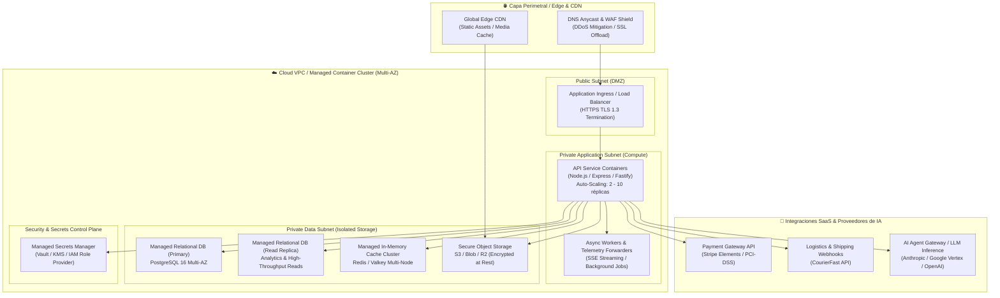

# ☁️ [DEP-XXXX] Diagrama de Despliegue Multi-Cloud Agnóstico

| Campo | Valor / Descripción |
| :--- | :--- |
| **Identificador:** | `DEP-XXXX` (Formato `DEP-XXXX`, inmutable y secuencial) |
| **Arquitectura de Referencia:** | Microservicios / Modular Monolith sobre Contenedores & Servicios Gestionados |
| **Proveedores Compatibles:** | AWS, GCP, Azure, Oracle Cloud (OCI), Cloudflare, Supabase / Vercel |
| **Estado:** | [DRAFT \| IN REVIEW \| APPROVED \| PROVISIONED] |
| **Topología de Red Asociada:** | [`SEC-NET-XXXX`](../network-topology/SEC-NET-TEMPLATE.md) |
| **Matriz de Ambientes:** | [`ENV-MATRIX`](../../environments/ENV-MATRIX-TEMPLATE.md) |
| **Modelo FinOps:** | [`FINOPS-XXXX`](../../finops/FINOPS-TEMPLATE.md) |

---

## 1. Propósito y Principios de Despliegue

Este artefacto define la **topología física y lógica de despliegue**, especificando cómo se distribuyen los contenedores de cómputo, los almacenes de datos persistentes y los servicios perimetrales (Edge/CDN). 

> [!IMPORTANT]
> **Agnosticismo de Infraestructura:** El diseño está estructurado por **capacidades conceptuales** (Edge, Ingress, Compute, Managed Storage, Caching, Secrets Vault) para permitir el despliegue equivalente en cualquier proveedor de nube pública o híbrida.

---

## 2. Diagrama de Despliegue Conceptual (Mermaid C4 Deployment)

---

## 3. Matriz de Mapeo de Servicios Multi-Cloud

Esta tabla traduce cada componente conceptual a los servicios específicos de los principales proveedores de nube:

| Componente Conceptual | AWS | Google Cloud (GCP) | Microsoft Azure | Oracle Cloud (OCI) | Cloudflare + Supabase / Vercel |
| :--- | :--- | :--- | :--- | :--- | :--- |
| **DNS & WAF** | Route 53 + AWS WAF | Cloud DNS + Cloud Armor | Azure DNS + Azure WAF | OCI DNS + OCI WAF | Cloudflare DNS + Cloudflare WAF |
| **Global CDN** | CloudFront | Cloud CDN | Azure Front Door / CDN | OCI CDN | Cloudflare CDN |
| **Load Balancer** | Application Load Balancer (ALB) | Cloud Load Balancing | Azure Application Gateway | OCI Flexible Load Balancer | Vercel Edge Ingress |
| **Cómputo / API** | ECS Fargate / EKS | Cloud Run / GKE Autopilot | Container Apps / AKS | OCI Container Instances / OKE | Vercel Serverless / Containers |
| **Workers Asíncronos** | ECS Fargate + SQS | Cloud Run Jobs + Pub/Sub | Azure Functions + Service Bus | OCI Functions + Queue | Cloudflare Workers / Inngest |
| **Base de Datos SQL** | Amazon RDS PostgreSQL Multi-AZ | Cloud SQL PostgreSQL Multi-Zone | Azure Database for PostgreSQL Flexible | OCI Base Database Service PostgreSQL | Supabase Managed PostgreSQL |
| **Caché en Memoria** | ElastiCache Redis / MemoryDB | Memorystore for Redis | Azure Cache for Redis | OCI Cache (Redis) | Upstash Redis / Cloudflare KV |
| **Object Storage** | Amazon S3 (KMS SSE-S3) | Cloud Storage (GCS) | Azure Blob Storage | OCI Object Storage | Cloudflare R2 / Supabase Storage |
| **Gestión de Secretos** | AWS Secrets Manager + KMS | Secret Manager + Cloud KMS | Azure Key Vault | OCI Vault (KMS) | Cloudflare Secrets / Vault |

---

## 4. Requerimientos No Funcionales (RNFs) de Infraestructura

1. **Alta Disponibilidad (HA):** Despliegue distribuido en mínimo 2 Zonas de Disponibilidad (Multi-AZ) con failover automático de base de datos en menos de 60 segundos.
2. **Auto-Escalado Elástico:** Reglas de escalado horizontal basadas en CPU ($\ge 70\%$) y tasa de requests por segundo ($> 500$ req/s por contenedor).
3. **Cifrado de Extremo a Extremo:** TLS 1.3 en tránsito y cifrado en reposo con claves gestionadas (AES-256 / KMS).
4. **Respaldo y Recuperación (RPO / RTO):**
   - **RPO (Pérdida máxima de datos):** $< 5$ minutos (Point-in-Time Recovery continuo).
   - **RTO (Tiempo máximo de recuperación):** $< 30$ minutos (Infraestructura como Código / Terraform).
