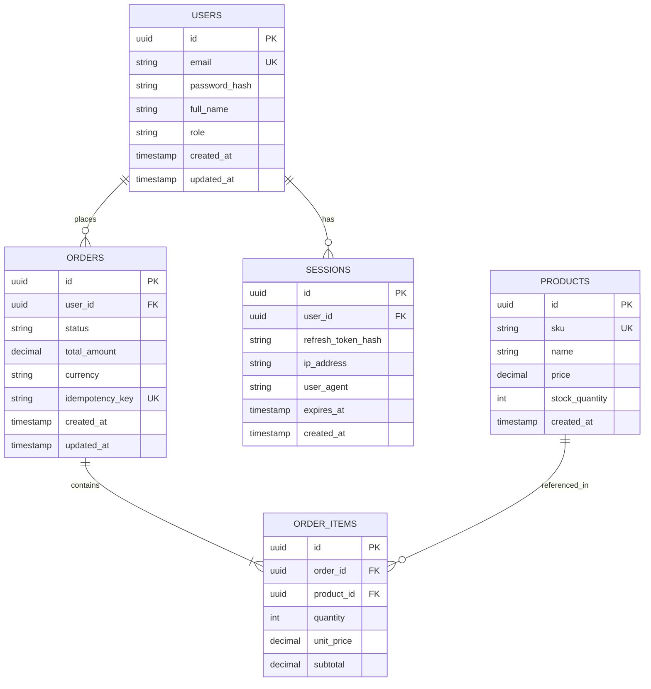

# 🗄️ [ERD-XXXX] Diagrama Entidad-Relación: Modelo de Datos

**Identificador:** `ERD-XXXX`  
**Motor de Persistencia:** PostgreSQL 16+  
**Dominio:** [Núcleo de Datos / Facturación / etc.]  

---

## 1. Diagrama Entidad-Relación

## 2. Índices y Restricciones Clave
- `USERS(email)`: Índice único B-Tree.
- `ORDERS(idempotency_key)`: Índice único con filtrado parcial.
- `ORDERS(user_id, created_at DESC)`: Índice compuesto para consultas rápidas de historial.
- `SESSIONS(expires_at)`: Índice para tareas automáticas de limpieza (purge).
