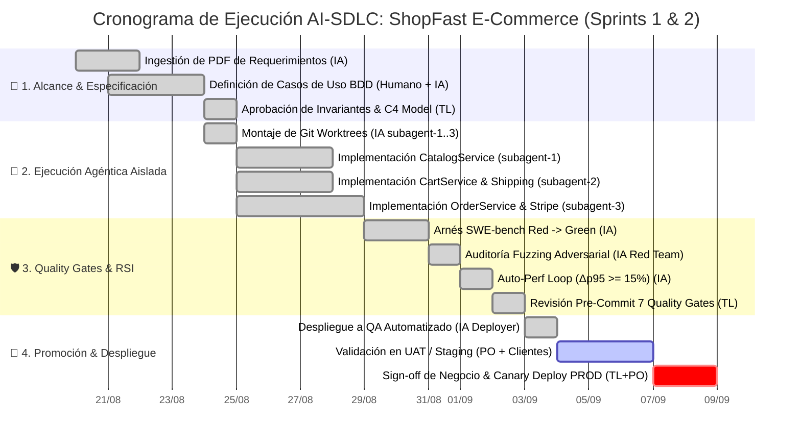
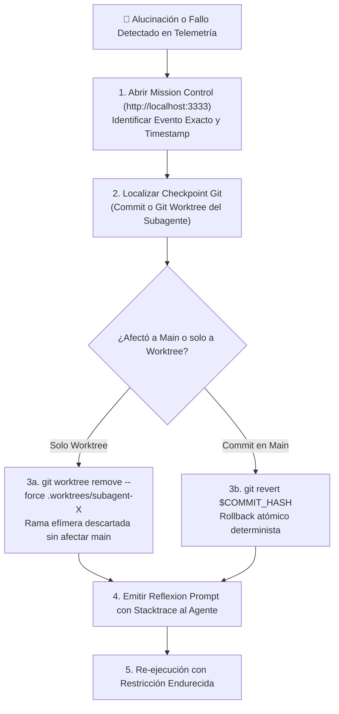

# ⏱️ [GANTT-XXXX] Cronograma Dinámico de Ejecución Humano-IA & Protocolo de Rollback

| Campo | Valor / Descripción |
| :--- | :--- |
| **Identificador:** | `GANTT-XXXX` (Formato `GANTT-XXXX`, inmutable y secuencial) |
| **Objetivo:** | Mapeo temporal de responsabilidades (Agente IA vs. Tech Lead vs. Product Owner) y auditoría de checkpoints |
| **Audiencia:** | Tech Leads, Project Managers, Product Owners y Subagentes IA |
| **Fuente de Eventos:** | Telemetría en tiempo real (`.agents/telemetry/events.jsonl`) |
| **Red de Trazabilidad:** | [`NET-XXXX`](../use-case-network/NET-TEMPLATE.md) |

---

## 1. Propósito del Cronograma Humano-IA

En un ciclo **AI-SDLC**, el trabajo se distribuye entre la **cognición estocástica del LLM** y la **gobernanza humana / determinista**:
1. **El Agente IA** acelera las tareas intensivas en código (scaffolding, tests BDD, implementación de endpoints, optimizaciones de rendimiento y fuzzing).
2. **El Tech Lead** define los invariantes duros, audita el código generado y resuelve bifurcaciones o alucinaciones.
3. **El Product Owner** valida la aceptación funcional en `UAT` y autoriza el despliegue a `PROD`.

---

## 2. Diagrama de Gantt de Ejecución (Mermaid)



---

## 3. Matriz de Responsabilidades (RACI Humano-IA)

| Fase del SDLC | Agente IA | Desarrollador | Tech Lead | Product Owner |
| :--- | :---: | :---: | :---: | :---: |
| **Ingestión de Requerimientos** | **R** (Responsable) | **C** (Consultado) | **A** (Aprobador) | **I** (Informado) |
| **Diseño Arquitectónico (C4 / BCE)** | **R** (Genera borradores) | **C** (Revisa) | **A** (Valida fronteras) | **I** |
| **Codificación en Git Worktrees** | **R** (Autónomo) | **C** (Pair review) | **I** | **I** |
| **Verificación Determinista (Quality Gates)**| **R** (Ejecuta) | **I** | **A** (Supervisa) | **I** |
| **Aceptación Funcional (UAT)** | **I** | **C** | **C** | **A** (Sign-off final) |
| **Despliegue a Producción** | **R** (Pipeline `/deploy`) | **I** | **A** (Autoriza) | **I** |

*R = Responsible, A = Accountable, C = Consulted, I = Informed.*

---

## 4. Protocolo de Auditoría Post-Mortem y Rollback ante Alucinaciones

Si durante la ejecución un subagente alucina, rompe la arquitectura o introduce regresiones, el **Tech Lead** sigue este protocolo determinista:



### Comandos de Recuperación Rápida para el Tech Lead:
```bash
# 1. Inspeccionar el log de eventos estructurados
grep "ERROR" .agents/telemetry/events.jsonl | tail -n 5

# 2. Descartar un worktree corrupto de un subagente sin tocar el resto
git worktree remove --force .worktrees/subagent-2
git branch -D feat/task-002-cart

# 3. Forzar auto-curación arquitectónica
npm run rsi:drift
```
