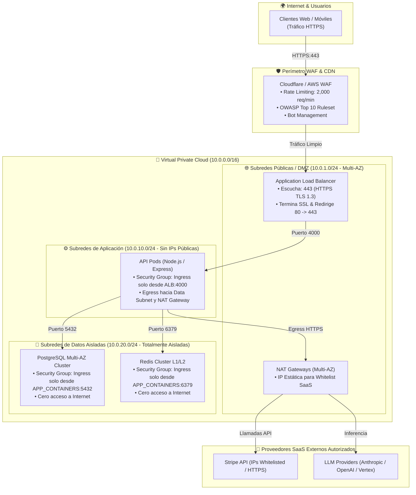

# 🛡️ [SEC-NET-XXXX] Topología de Red y Arquitectura de Seguridad Zero-Trust

| Campo | Valor / Descripción |
| :--- | :--- |
| **Identificador:** | `SEC-NET-XXXX` (Formato `SEC-XXXX`, inmutable y secuencial) |
| **Dominio de Seguridad:** | Aislamiento de Red, Segmentación en Subnets y Control de Tráfico |
| **Nivel de Cumplimiento:** | PCI-DSS Level 1 / SOC 2 Type II / ISO 27001 |
| **Diagrama de Despliegue Vinculado:** | [`DEP-XXXX`](../deployment/DEP-TEMPLATE.md) |
| **Matriz de Ambientes:** | [`ENV-MATRIX`](../../environments/ENV-MATRIX-TEMPLATE.md) |

---

## 1. Principios de Seguridad de Red

La topología de red sigue el principio de **Defensa en Profundidad** y **Zero-Trust**:
1. **Segmentación Estricta:** Ningún componente de base de datos o almacenamiento persistente posee IP pública ni acceso directo a Internet.
2. **Tráfico Saliente Controlado (Egress Filtering):** Las subredes privadas solo acceden al exterior a través de **NAT Gateways** con IPs elásticas estáticas para llamadas a pasarelas (Stripe/CourierFast) y APIs de LLMs.
3. **Mínimo Privilegio en Security Groups:** Reglas de firewall de entrada (`Ingress`) explícitas, bloqueando todo puerto no utilizado por defecto.

---

## 2. Diagrama de Topología de Red y Flujo de Tráfico (Mermaid)

---

## 3. Matriz de Reglas de Firewall y Security Groups

| Security Group | Origen Permitido (Ingress) | Puerto / Protocolo | Destino Permitido (Egress) | Justificación |
| :--- | :--- | :--- | :--- | :--- |
| **`sg-alb`** | `0.0.0.0/0` (vía WAF) | `TCP 443` (HTTPS) | `sg-app` (`TCP 4000`) | Entrada pública de usuarios hacia balanceador. |
| **`sg-app`** | `sg-alb` | `TCP 4000` (HTTP) | `sg-db` (`5432`), `sg-redis` (`6379`), `nat-gw` (`443`) | Cómputo de microservicios y workers. |
| **`sg-db`** | `sg-app` | `TCP 5432` (PostgreSQL) | Ninguno (`DENY ALL`) | Persistencia relacional protegida. |
| **`sg-redis`** | `sg-app` | `TCP 6379` (Redis) | Ninguno (`DENY ALL`) | Memoria caché ultrarrápida. |

---

## 4. Políticas IAM y Control de Acceso (Least Privilege)

1. **Roles por Contenedor (Task Roles / Workload Identity):** Cada pod de aplicación asume un rol IAM específico con permisos mínimos estrictos (ej. solo lectura/escritura en su bucket de S3 específico, lectura exclusiva de sus propios secretos en Secrets Manager).
2. **Cero Credenciales Estáticas:** Prohibido el uso de `AWS_ACCESS_KEY_ID` o service accounts fijas en código; todo acceso se autentica mediante tokens rotativos temporales de IAM.
