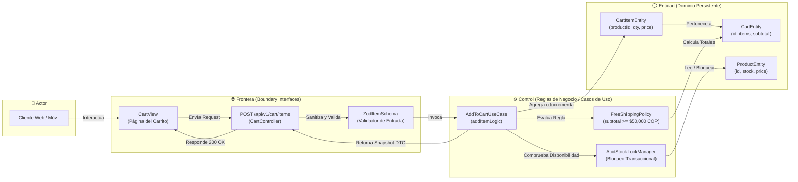

# 🛡️ [ROB-XXXX] Diagrama de Robustez (Boundary-Control-Entity)

| Campo | Valor / Descripción |
| :--- | :--- |
| **Identificador:** | `ROB-XXXX` (Formato `ROB-XXXX`, inmutable y secuencial) |
| **Caso de Uso Vinculado:** | [`UC-XXXX`](../../use-cases/UC-TEMPLATE.md) |
| **Módulo:** | [e.g. Carrito de Compras & Cálculo de Envío] |
| **Estado:** | [APPROVED \| IMPLEMENTED] |

---

## 1. Propósito del Diagrama de Robustez

El Diagrama de Robustez actúa como el **puente formal entre el lenguaje del negocio (Casos de Uso) y el diseño de clases e implementación (Arquitectura)**, siguiendo el patrón **BCE (Boundary - Control - Entity)** de Ivar Jacobson:

1. **Frontera / Boundary (`⊢`):** Puntos de contacto externos (UI Web, API REST Endpoints, Payloads JSON).
2. **Control (`⚙️`):** Reglas de negocio, coordinadores de flujo y casos de uso.
3. **Entidad (`⚪`):** Modelos de dominio persistentes y estructuras de datos con estado.

> [!IMPORTANT]
> **Regla de Oro de Robustez en AI-SDLC:**
> - Una **Frontera** NUNCA puede comunicarse directamente con una **Entidad** (prohibido que un controlador HTTP haga consultas SQL o modifique entidades directamente).
> - Toda interacción debe pasar obligatoriamente por un **Control**.

---

## 2. Diagrama de Robustez BCE (Mermaid)

---

## 3. Matriz de Componentes BCE

| Elemento | Tipo | Rol Arquitectónico | Archivo de Código Fuente |
| :--- | :--- | :--- | :--- |
| `CartController` | **Frontera** | Exposición de endpoint HTTP y parsing | `src/presentation/controllers/cart.controller.ts` |
| `AddToCartUseCase` | **Control** | Orquestación de la regla de negocio | `src/application/use-cases/add-to-cart.use-case.ts` |
| `FreeShippingPolicy` | **Control** | Cálculo de reglas de envío condicional | `src/domain/policies/free-shipping.policy.ts` |
| `CartEntity` | **Entidad** | Agregado raíz con estado de la sesión | `src/domain/entities/cart.entity.ts` |
| `ProductEntity` | **Entidad** | Modelo de producto con stock y precio | `src/domain/entities/product.entity.ts` |

---

## 4. Verificación Determinista de Robustez

- **Linter de Capas:** El script `npm run rsi:drift` valida que ninguna clase de `presentation/` (Frontera) invoque drivers de persistencia directamente, garantizando la fidelidad con este diagrama de robustez.
