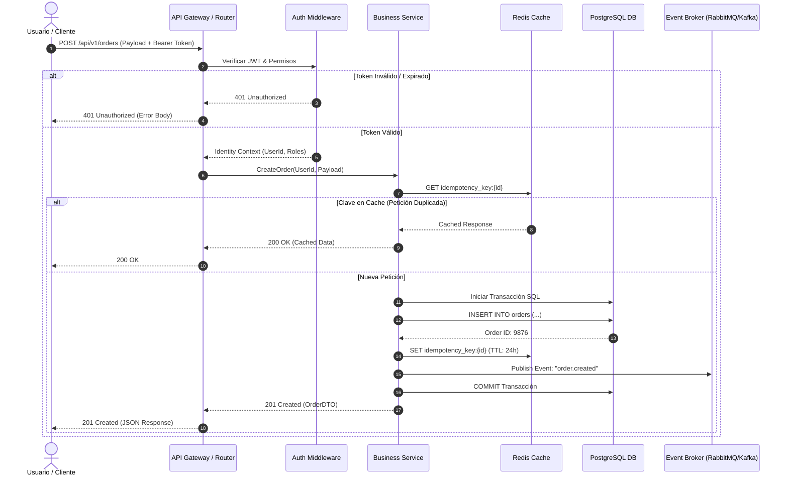

# 📊 [SEQ-XXXX] Diagrama de Secuencia: Flujo de Interacción

**Identificador:** `SEQ-XXXX`  
**Caso de Uso Asociado:** [`UC-XXXX`](../../use-cases/UC-TEMPLATE.md)  
**Dominio:** [Autenticación / Pagos / etc.]  

---

## 1. Diagrama de Secuencia

## 2. Participantes y Protocolos
| Participante | Tipo | Protocolo / Tecnología |
| :--- | :--- | :--- |
| `API Gateway` | Punto de entrada | HTTP/2, TLS 1.3 |
| `Business Service` | Lógica de Dominio | In-Memory / gRPC |
| `Redis Cache` | Caché e Idempotencia | Redis RESP |
| `PostgreSQL DB` | Persistencia ACID | TCP Socket / SQL |
| `Event Broker` | Asincronía & Eventos | AMQP / Kafka Protocol |
