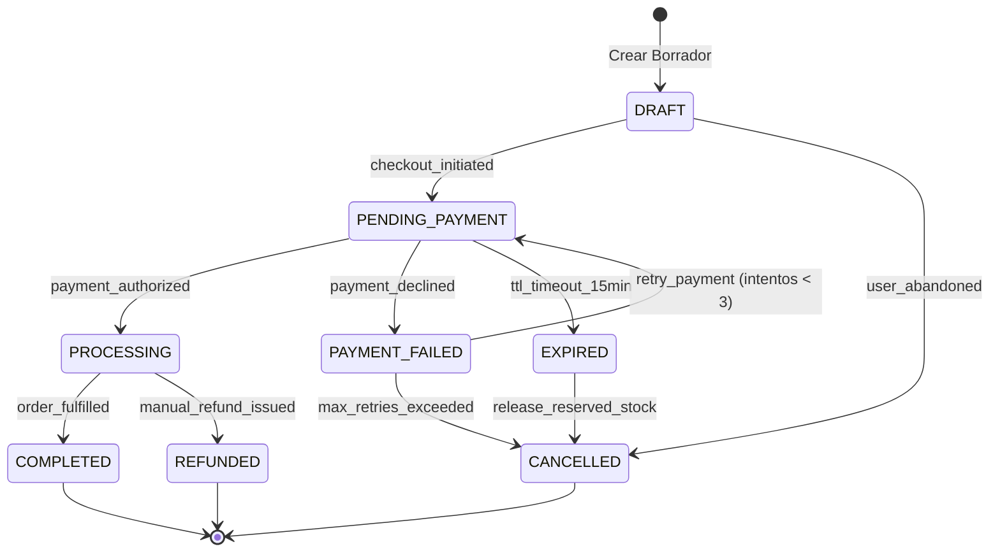

# 🔀 [STM-XXXX] Diagrama de Estados: Ciclo de Vida de la Entidad

**Identificador:** `STM-XXXX`  
**Entidad Modelada:** `Order` / `UserSession` / `Invoice`  
**Propósito:** Definir los estados válidos, eventos desencadenantes y transiciones permitidas.

---

## 1. Máquina de Estados

## 2. Matriz de Transición de Estados
| Estado Origen | Evento / Trigger | Estado Destino | Guard / Condición |
| :--- | :--- | :--- | :--- |
| `DRAFT` | `checkout_initiated` | `PENDING_PAYMENT` | Carrito no vacío |
| `PENDING_PAYMENT` | `payment_authorized` | `PROCESSING` | Webhook de pasarela confirmado |
| `PENDING_PAYMENT` | `ttl_timeout` | `EXPIRED` | 15 minutos sin pago |
| `PAYMENT_FAILED` | `retry_payment` | `PENDING_PAYMENT` | Reintentos < 3 |
| `PROCESSING` | `order_fulfilled` | `COMPLETED` | Factura y entrega confirmada |
