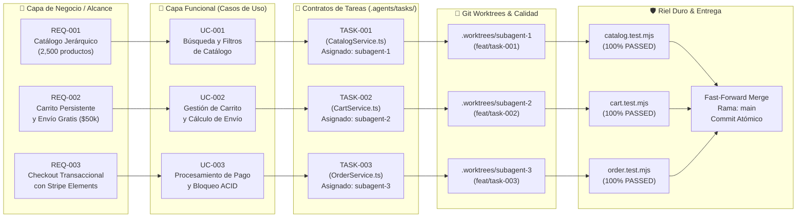

# 🕸️ [NET-XXXX] Red de Trazabilidad y Dependencias de Casos de Uso

| Campo | Valor / Descripción |
| :--- | :--- |
| **Identificador:** | `NET-XXXX` (Formato `NET-XXXX`, inmutable y secuencial) |
| **Objetivo del Documento:** | Mapeo de trazabilidad end-to-end desde Requerimientos de Negocio hasta Commits de Subagentes |
| **Audiencia:** | Tech Leads, Product Owners, Arquitectos y Subagentes IA |
| **Última Actualización:** | Septiembre 2026 |

---

## 1. Propósito de la Red de Trazabilidad

Este artefacto ofrece al **Tech Lead** y a los **Stakeholders de Negocio** una vista panorámica inmediata de:
1. Cómo se fragmentaron los requerimientos de alto nivel en **Casos de Uso Funcionales (`UC-XXXX`)**.
2. Qué **Contrato de Tarea (`TASK-XXXX`)** y **Subagente IA** implementó cada funcionalidad.
3. Qué **Git Worktree**, **Suite de Tests** y **Commit Atómico** respalda el entregable.

---

## 2. Grafo de Red de Trazabilidad (Mermaid)



---

## 3. Matriz de Auditoría y Estado de Trazabilidad

| ID Requerimiento | ID Caso de Uso | ID Tarea Agente | Subagente Dueño | Componente Afectado | Quality Gate Determinista | Estado Final |
| :--- | :--- | :--- | :--- | :--- | :--- | :---: |
| **REQ-001** | [`UC-XXXX`](../../use-cases/UC-TEMPLATE.md) | `TASK-001` | `subagent-1` | `src/modules/catalog/` | `node --test catalog.test.mjs` | 🟢 VERIFIED |
| **REQ-002** | [`UC-002`](../../use-cases/UC-TEMPLATE.md) | `TASK-002` | `subagent-2` | `src/modules/cart/` | `node --test cart.test.mjs` | 🟢 VERIFIED |
| **REQ-003** | [`UC-003`](../../use-cases/UC-TEMPLATE.md) | `TASK-003` | `subagent-3` | `src/modules/orders/` | `node --test order.test.mjs` | 🟢 VERIFIED |

---

## 4. Guía para el Tech Lead: ¿Cómo auditar el avance?

1. **Revisión del Grafo:** Abre este diagrama para verificar si algún caso de uso tiene dependencias bloqueantes o circulares.
2. **Auditoría de Subagentes:** Consulta la tabla para saber con precisión qué subagente desarrolló cada módulo.
3. **Consistencia de Commits:** Cada commit atómico en `main` debe contener en su mensaje el formato:
   ```text
   feat(cart): [UC-002] [TASK-002] implement persistent cart and free shipping logic
   ```
