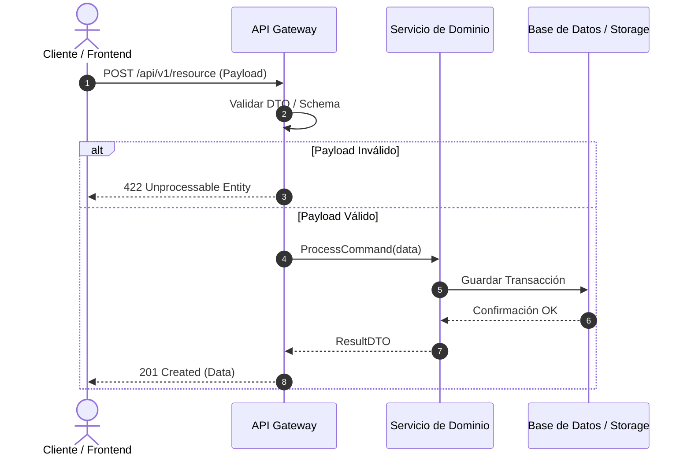

# [RFC-XXXX] Nombre de la Característica / Feature

**Estado:** [DRAFT | IN REVIEW | APPROVED | IMPLEMENTED]  
**Fecha:** AAAA-MM-DD  
**Autor:** Nombre del Autor / Agente IA  

---

## 1. Problema & Objetivos
- **Problema:** ¿Qué problema de negocio o técnico estamos resolviendo?
- **Objetivo Principal:** ¿Cuál es el resultado esperado?
- **Fuera de Alcance (Out of Scope):** ¿Qué NO resolveremos en esta iteración?

---

## 2. Flujo de Interacción & Arquitectura


---

## 3. Criterios de Aceptación (BDD / Gherkin)
```gherkin
Escenario: Ejecución exitosa del flujo principal
  Dado que el usuario tiene una sesión activa válida
  Y envía los parámetros obligatorios completos
  Cuando la solicitud es recibida por el servicio
  Entonces el registro debe persistirse en el almacenamiento
  Y la respuesta debe contener un código de estado 201.

Escenario: Validación de datos de entrada incorrectos
  Dado que el payload carece del campo obligatorio "id"
  Cuando la solicitud llega al endpoint
  Entonces el sistema debe responder inmediatamente con código 422
  Y detallar los errores de validación sin consultar la base de datos.
```

---

## 4. Riesgos & Plan de Mitigación
| Riesgo Identificado | Nivel de Impacto | Estrategia de Mitigación |
| :--- | :--- | :--- |
| Pérdida de conectividad con storage | Alto | Implementar Retry con Exponential Backoff |
| Carga concurrente elevada | Medio | Aplicar límites de tasa (Rate Limiting) |
