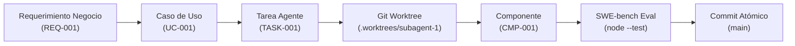

# 🎯 [UC-XXXX] Nombre del Caso de Uso Formal

| Campo | Valor / Descripción |
| :--- | :--- |
| **Identificador Único:** | `UC-XXXX` (Formato `UC-XXXX`, inmutable y secuencial) |
| **Módulo / Dominio:** | [e.g. Catálogo / Carrito / Órdenes / Pagos] |
| **Prioridad de Negocio:** | [CRÍTICA (P0) \| ALTA (P1) \| MEDIA (P2) \| BAJA (P3)] |
| **Estado:** | [DRAFT \| IN REVIEW \| APPROVED \| IMPLEMENTED \| VERIFIED] |
| **Impacto en Negocio / ROI:** | [e.g. Incremento del 15% en tasa de conversión / Reducción de carritos abandonados] |
| **Requerimiento Origen:** | [`REQ-001`](../specs/RFC-TEMPLATE.md) |
| **Contrato de Tarea Agente:** | [`.agents/tasks/TASK-001.md`](../../.agents/tasks/TASK_TEMPLATE.md) |
| **Diagrama de Secuencia:** | [`SEQ-XXXX`](../diagrams/sequences/SEQ-TEMPLATE.md) |
| **Diagrama de Robustez:** | [`ROB-XXXX`](../diagrams/robustness/ROB-TEMPLATE.md) |
| **Diagrama de Componentes:** | [`CMP-XXXX`](../diagrams/components/CMP-TEMPLATE.md) |
| **Red de Trazabilidad:** | [`NET-XXXX`](../diagrams/use-case-network/NET-TEMPLATE.md) |

---

## 1. Descripción del Negocio
[Explicación concisa y en lenguaje funcional de qué necesidad de negocio o del cliente resuelve este caso de uso.]

---

## 2. Actores y Roles
- **Actor Principal:** [e.g. Cliente Final Registrado / Usuario Invitado / Operador de Tienda]
- **Actores Secundarios / Sistemas Externos:** [e.g. Pasarela de Pagos Stripe / ERP / Servicio de CourierFast]
- **Subagente IA Responsable:** `subagent-1` (Dueño del componente y responsable del PR)

---

## 3. Precondiciones Invariables
1. [e.g. El usuario debe poseer una sesión autenticada con JWT válido o cookie de sesión activa.]
2. [e.g. El catálogo de productos debe estar inicializado y el stock disponible ser mayor a cero.]
3. [e.g. El valor del pedido debe estar expresado en la moneda oficial configurada (COP / USD).]

---

## 4. Flujo Nominal / Principal (Happy Path)
1. El **Cliente** navega al producto `X` y pulsa *"Agregar al Carrito"* con una cantidad válida `N`.
2. El **Sistema** valida la disponibilidad de inventario en tiempo real.
3. El **Sistema** crea o actualiza la entidad `CartItem` aplicando la política de persistencia dual (Redis L1 / SQL L2).
4. El **Sistema** recalcula automáticamente los subtotales, impuestos y aplica la regla de **Envío Gratuito** si el subtotal supera el umbral configurado ($50,000 COP).
5. El **Sistema** retorna la respuesta `HTTP 200 OK` con el snapshot actualizado del carrito en menos de 200ms.

---

## 5. Flujos Alternativos (Alternate Paths)
- **5.a Cliente No Autenticado (Usuario Invitado / Guest Checkout):**
  - El sistema genera un `guestSessionId` efímero persistido en LocalStorage/Redis con TTL de 7 días.
  - Al autenticarse posteriormente, el sistema fusiona automáticamente el carrito anónimo con el carrito persistente del usuario registrado.
- **5.b Descuento o Cupón Promocional Aplicado:**
  - El cliente ingresa un código de cupón válido.
  - El sistema valida el cupón contra el servicio de promociones y recalcula el total descontando el porcentaje correspondiente.

---

## 6. Casos Límite y Laterales (Edge Cases & Lateral Scenarios)
- **6.a Modificación Simultánea del Carrito en Múltiples Dispositivos:**
  - Si el usuario agrega items desde el móvil y la laptop simultáneamente, el sistema aplica resolución de conflictos basada en versionado optimista (`ETag` / `versionNumber`).
- **6.b Latencia Degradada o Timeout de Servicio Externo (Circuit Breaker):**
  - Si el servicio de inventario tarda más de 800ms, el sistema activa el fallback leyendo la caché L1 e informando al usuario con advertencia no bloqueante.

---

## 7. Casos Frontera / Umbrales Numéricos (Boundary Cases)
- **7.a Exactamente en el Umbral de Envío Gratis ($50,000 COP):**
  - Carrito con subtotal de $49,999.99 COP $\rightarrow$ Costo de envío: $8,500 COP.
  - Carrito con subtotal de $50,000.00 COP $\rightarrow$ Costo de envío: $0.00 COP (`freeShippingApplied: true`).
- **7.b Cantidad Máxima Permitida por Item:**
  - Cantidad = 99 items $\rightarrow$ Permitido.
  - Cantidad = 100 items $\rightarrow$ Rechazado con mensaje: *"Máximo 99 unidades por compra minorista"*.

---

## 8. Casos Negativos y Error Testing (Negative Cases & Defensive Gates)
- **8.a Cantidades Negativas o Cero (Underflow Attack):**
  - Payload con `quantity: -5` o `quantity: 0`.
  - El sistema intercepta mediante el esquema de validación Zod y retorna `HTTP 400 Bad Request` con código `INVALID_QUANTITY`.
- **8.b Inyección de Caracteres Especiales o Payloads Masivos:**
  - Nombres o IDs con inyecciones SQL (`' OR '1'='1`) o JSON payloads superiores a 1MB.
  - El middleware de seguridad sanitiza y rechaza con `HTTP 400 Bad Request` / `HTTP 413 Payload Too Large`.
- **8.c Agotamiento de Stock en Concurrencia (Race Condition):**
  - Dos usuarios intentan comprar la última unidad al mismo milisegundo.
  - El bloqueo transaccional ACID (`SELECT FOR UPDATE`) permite al primer usuario y retorna `HTTP 409 Conflict` (*"Producto agotado durante la transacción"*) al segundo sin corromper el inventario.

---

## 9. Postcondiciones Invariables
- **En Caso de Éxito:**
  - Estado del carrito actualizado en la base de datos y en caché Redis L1.
  - Evento de dominio `CartUpdatedEvent` emitido para observabilidad y telemetría.
- **En Caso de Fallo:**
  - Estado del carrito previo intacto (Rollback transaccional estricto).
  - Ningún registro huérfano ni débito monetario generado.

---

## 10. Criterios de Aceptación Formales (BDD Gherkin)

```gherkin
Feature: [UC-XXXX] Gestión de Carrito de Compras y Envío Gratis

  Scenario: [Happy Path] Agregar producto con stock disponible
    Given un usuario con sesión activa
    And un producto "PROD-001" con stock disponible de 10 unidades
    When el usuario agrega 2 unidades de "PROD-001" al carrito
    Then el sistema responde con HTTP 200 OK
    And el carrito contiene 2 unidades de "PROD-001"
    And el tiempo de respuesta es menor a 200ms

  Scenario: [Boundary] Envío gratuito al alcanzar el umbral de $50,000 COP
    Given un carrito con un subtotal de $50,000 COP
    When se calcula el costo total de la orden
    Then el costo de envío es exactamente $0 COP
    And la propiedad "freeShippingApplied" es true

  Scenario: [Negative] Rechazo de cantidades negativas (Zod Validation)
    Given un usuario enviando un payload con cantidad -3
    When se procesa la solicitud en el endpoint "POST /api/v1/cart/items"
    Then el sistema responde con HTTP 400 Bad Request
    And el cuerpo de respuesta contiene el error "Quantity must be greater than 0"
    And el inventario no sufre modificaciones
```

---

## 11. Matriz de Trazabilidad Bidireccional


